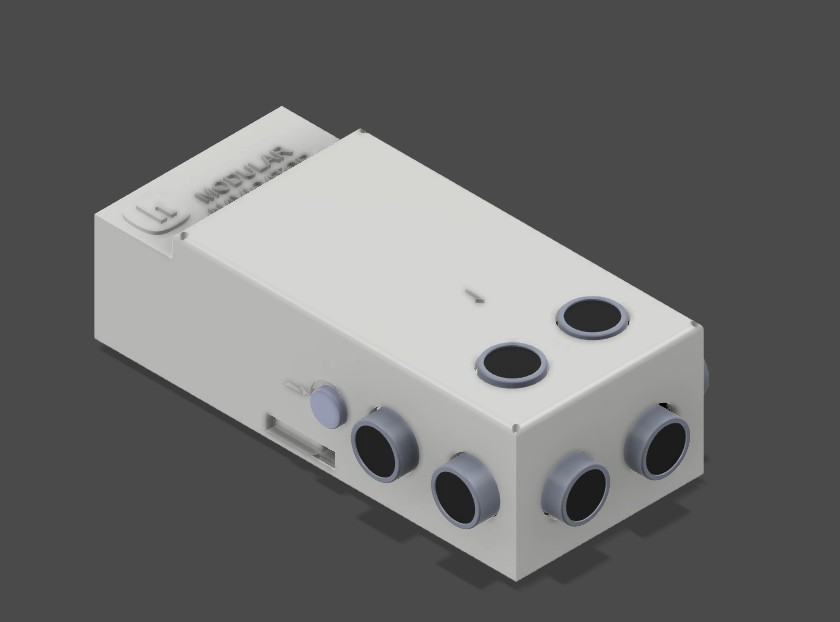
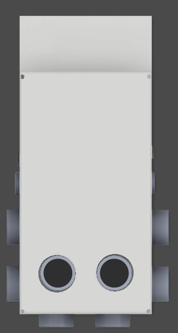
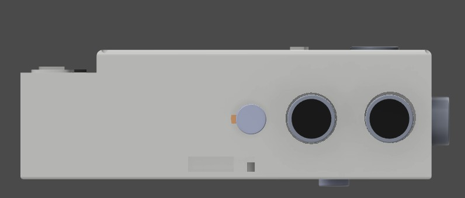
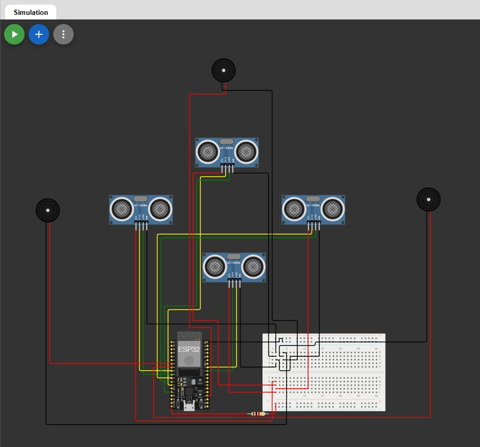
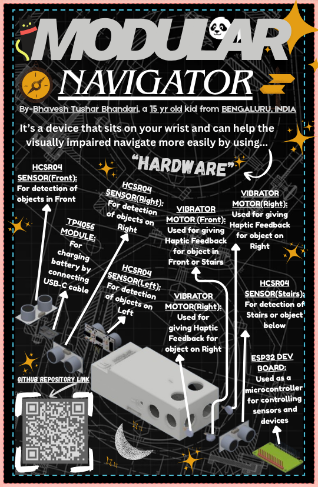

# Modular Navigator



A modular assistive navigation device designed to help visually impaired users detect obstacles and navigate more safely using directional haptic feedback.

---

# Quick Overview

Modular Navigator is a wearable assistive hardware device for visually impaired users.

It uses:

* 4 ultrasonic sensors
* ESP32 processing
* Directional vibration motors

to detect nearby obstacles and provide haptic feedback in different directions.

The device is compact, modular, rechargeable, and designed inside a custom 3D printable enclosure.

---

# Full Device Renders

| Top View                                    | Side View                                     |
| ------------------------------------------- | --------------------------------------------- |
|  |  |

---

# What is Modular Navigator?

Modular Navigator is a wearable embedded hardware device that uses ultrasonic sensors and vibration motors to help visually impaired users understand obstacles around them without requiring visual input.

The system detects obstacles in multiple directions:

* Front
* Left
* Right
* Downward (stairs, ledges, holes)

Distance data from the sensors is processed using an ESP32 Dev Board. Depending on the obstacle direction, vibration motors provide directional haptic feedback to the user.

The entire system is housed inside a custom-designed 3D printable enclosure with a modular structure so it can later be attached to a walking stick or wearable support system.

---

# Why I Made This

I wanted to build something that solves a real-world problem instead of creating just another electronics project.

Many assistive devices are expensive, bulky, difficult to repair, or difficult to customize. My goal was to create a compact and modular system that could provide intuitive obstacle awareness while remaining lightweight and portable.

I also wanted to challenge myself by learning:

* CAD design
* Embedded electronics
* Sensor integration
* Power systems
* Product prototyping
* Hardware enclosure design

This project started as a simple concept and slowly evolved into a complete assistive hardware prototype.

---

# Features

* Multi-direction obstacle detection
* Stair and ledge detection
* Directional vibration feedback
* Rechargeable battery-powered system
* Compact 3D printable enclosure
* Modular and portable design
* Embedded hardware integration

---

# How It Works

1. Ultrasonic sensors continuously measure distances in multiple directions.
2. Distance data is sent to the ESP32.
3. The ESP32 processes obstacle information.
4. Corresponding vibration motors activate depending on obstacle direction.
5. The user receives haptic feedback to navigate more safely.

---

# Example Usage

A user walking with Modular Navigator receives vibration feedback whenever nearby obstacles are detected.

* Left vibration → obstacle on left
* Right vibration → obstacle on right
* Front vibration → object ahead
* Downward detection → stairs or ledge warning

This allows the user to understand nearby surroundings without relying completely on visual awareness.

---

# Exploded Views

## Top Exploded View


## Side Exploded View


## Home Exploded View


---

# Hardware Used

| Component              | Purpose                         |
| ---------------------- | ------------------------------- |
| ESP32 Dev Board        | Main microcontroller            |
| HC-SR04 Sensors        | Obstacle detection              |
| Vibration Motors       | Haptic feedback                 |
| TP4056 Module          | Battery charging and protection |
| MT3608 Boost Converter | Stable 5V power output          |
| 18650 Battery          | Portable power source           |
| 2N2222 Transistors     | Motor driving                   |
| Resistors and Diodes   | Signal protection               |

---

# Electronics Overview

## Power System

```text id="xpxb6f"
Battery → TP4056 (charging + protection)
TP4056 OUT → MT3608 Boost Converter → 5V Output
5V → ESP32 VIN Pin
GND → Common Ground
```

---

# Ultrasonic Sensors Wiring

Each sensor is connected as follows:

* VCC → 5V
* GND → GND
* TRIG → ESP32 GPIO
* ECHO → Voltage Divider → ESP32 GPIO

## Voltage Divider (Mandatory)

* 1kΩ resistor
* 2kΩ resistor

This reduces the 5V ECHO signal to approximately 3.3V for safe ESP32 input.

---

# GPIO Mapping

## Sensors

| Sensor | TRIG    | ECHO    |
| ------ | ------- | ------- |
| Front  | GPIO 12 | GPIO 13 |
| Left   | GPIO 25 | GPIO 26 |
| Right  | GPIO 27 | GPIO 14 |
| Down   | GPIO 18 | GPIO 19 |

---

# Vibration Motor Circuit

```text id="r26z0v"
ESP32 GPIO → 1k resistor → Base of 2N2222
Emitter → GND
Collector → Motor (-)
Motor (+) → 5V
Diode across motor (reverse biased)
```

## Motor GPIO Mapping

| Motor       | GPIO    |
| ----------- | ------- |
| Left Motor  | GPIO 32 |
| Right Motor | GPIO 33 |
| Front Motor | GPIO 15 |

---

# Electronics Diagram



---

# Wokwi Simulation

Wokwi was used to:

* Test ultrasonic sensor logic
* Simulate vibration feedback
* Validate GPIO mapping
* Debug code before hardware assembly

## Wokwi Link

[Wokwi Simulation](https://wokwi.com/projects/461725213892270081)

---

# CAD and Enclosure

The enclosure was fully designed in CAD and optimized for:

* Internal component fitting
* Wiring space
* Battery placement
* Modular assembly
* 3D printing

The enclosure consists of:

* Main body
* Removable lid
* Internal mounting structure

---

# How To Build Modular Navigator

## 1. Print the Enclosure

Print both parts of the enclosure:

* Main body
* Lid

Files are available inside:

```text id="2ttc5t"
CAD files/Printing Parts/
```

Recommended settings:

* PLA material
* 0.2 mm layer height
* 15–20% infill

---

## 2. Assemble the Electronics

Mount the following components inside the enclosure:

* ESP32 Dev Board
* 4x HC-SR04 Sensors
* 3x Vibration Motors
* TP4056 Module
* MT3608 Boost Converter
* 18650 Battery

Use M1.5 screws where required for mounting.

---

## 3. Complete the Wiring

Follow the wiring diagram and GPIO mapping provided in:

```text id="k3slwi"
Electronics/Electronics.md
```

Important:

* Use voltage dividers on all HC-SR04 ECHO pins
* Ensure all grounds are connected together

---

## 4. Upload the Firmware

Open:

```text id="h7n5cq"
FIRMWARE/main.ino
```

Upload the code to the ESP32 using Arduino IDE.

Required libraries:

* ESP32 board package

---

## 5. Final Assembly

After testing:

* Place all electronics into the enclosure
* Route wires through internal channels
* Attach the lid
* Tighten screws carefully

The device is now ready for testing.

---

# Zine



---

# Bill of Materials (BOM)

The complete BOM is available in:

```text id="j4j4eg"
BOM.csv
```

## Bill of Materials Overview

| Item                   | Quantity |
| ---------------------- | -------- |
| ESP32 Dev Board        | 1        |
| HC-SR04 Sensors        | 4        |
| Vibration Motors       | 3        |
| TP4056 Module          | 1        |
| MT3608 Boost Converter | 1        |
| 18650 Battery          | 1        |
| 2N2222 Transistors     | 3        |
| Resistors              | Multiple |
| Diodes                 | 3        |
| M1.5 Screws            | Multiple |

---

# Included Files

* CAD source files
* STEP exports
* Printable enclosure files
* Firmware
* Wiring diagrams
* Electronics documentation
* BOM
* Zine
* Renders
* Exploded views

---

# Repository Structure

```text id="teh7eu"
├── CAD files
│   ├── Miscellaneous Parts_&_Images
│   ├── Model
│   └── Printing Parts
│
├── Electronics
│   ├── Electronics.jpg
│   └── Electronics.md
│
├── FIRMWARE
│   └── main.ino
│
├── IMAGES
│   ├── Exploded View
│   └── Render
|   └── Zine
│
├── BOM.csv
├── LICENSE
├── PLANNING DESIGN STAGE.md
└── README.md
```

---

# Final Note

This project taught me a lot about embedded hardware, CAD design, electronics integration, and product prototyping. What started as a simple idea slowly became a complete assistive hardware prototype focused on solving a real-world accessibility problem.
