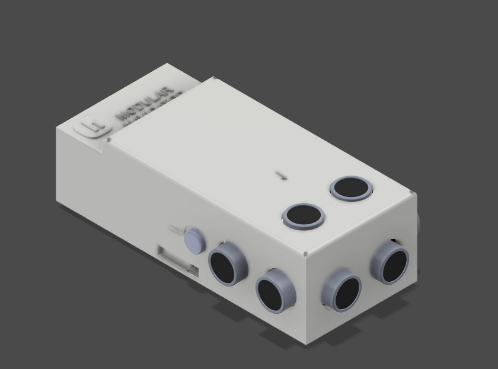
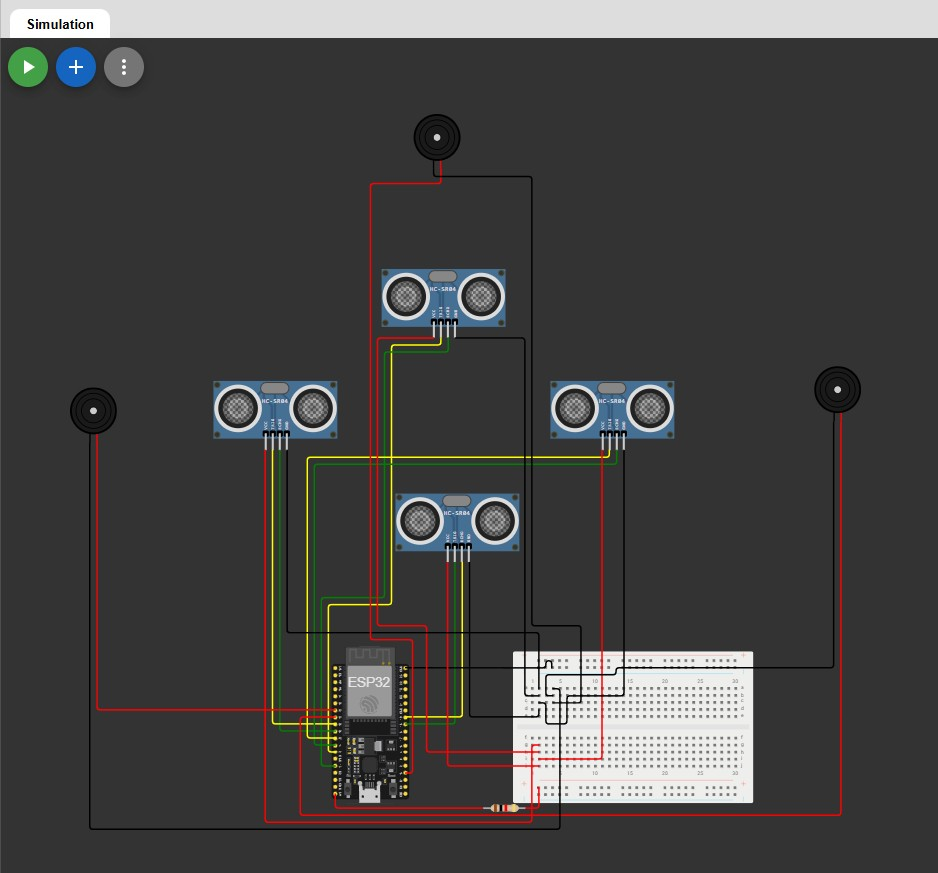
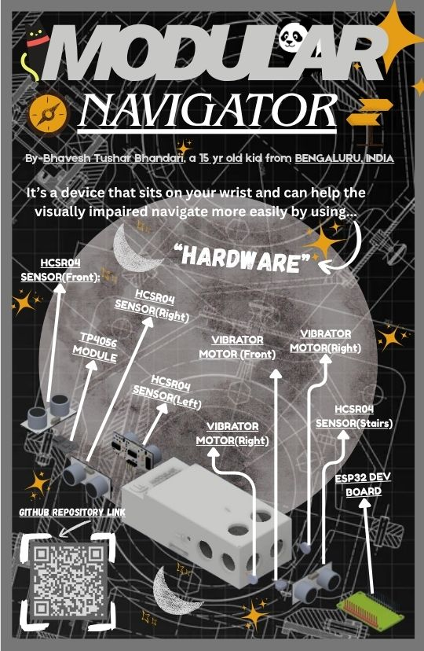

# Modular Navigator



## Modular Haptic Navigation Device for the Visually Impaired

Modular Navigator is a portable assistive navigation device that provides directional haptic feedback for obstacle awareness.

The system uses four HC-SR04 ultrasonic sensors to monitor the area around the user. Distance measurements are processed by an ESP32, which activates vibration motors corresponding to the detected obstacle direction.

Unlike audio-based navigation aids, the device uses vibration feedback, allowing users to remain aware of surrounding sounds while receiving environmental information.

---

# Project Status

🚧 **Design & Engineering Phase**

Completed:

* CAD enclosure design
* Electronics architecture
* Wiring schematic
* Component selection
* Bill of Materials (BOM)
* Firmware planning
* Wokwi simulation setup
* Manufacturing file preparation

Planned:

* Physical assembly
* Firmware deployment
* Hardware validation
* Real-world testing
* Design iteration

---

# Motivation

Many assistive navigation devices are expensive, difficult to repair, or rely heavily on audio feedback. This project explores a low-cost, open-source alternative that provides directional obstacle awareness through haptic feedback.

The goal is to investigate whether commonly available components, 3D-printed parts, and open-source tools can be used to create a modular navigation aid that is easy to reproduce, modify, and improve.

# Repository Highlights

* Fusion 360 CAD source files
* STEP and STL exports
* ESP32 firmware
* Electronics documentation
* KiCad schematic
* Wiring diagram
* Bill of Materials
* Design journal
* Wokwi simulation
* Build instructions
* Assembly renders and exploded views

---

# Device Overview

The device monitors four directions:

* Front
* Left
* Right
* Downward

When an obstacle is detected, the corresponding vibration motor is activated.

| Hazard             | Feedback                  |
| ------------------ | ------------------------- |
| Obstacle on Left   | Left vibration motor      |
| Obstacle on Right  | Right vibration motor     |
| Obstacle Ahead     | Front vibration motor     |
| Stairs / Drop-offs | Warning vibration pattern |

---

# Fully Assembled Device

## Front Render


---

# Interactive 3D Model

[Open Interactive 3D Mesh Grid View](CAD%20files/Model/Model_with%20electronics/ModularNavigator_Enclosure_v1_with_electronics.stl)

The model contains:

* Enclosure
* ESP32
* Battery
* Charging system
* Ultrasonic sensors
* Vibration motors
* Internal mounting structure

---

# System Architecture

## 1. Sensing System

### Components

* 4× HC-SR04 Ultrasonic Sensors

### Coverage

| Sensor   | Purpose                       |
| -------- | ----------------------------- |
| Front    | Detect obstacles ahead        |
| Left     | Detect obstacles on the left  |
| Right    | Detect obstacles on the right |
| Downward | Detect stairs and drop-offs   |

---

## 2. Processing System

### Controller

* ESP32 Development Board

### Responsibilities

* Read sensor measurements
* Calculate distances
* Determine obstacle direction
* Generate haptic feedback
* Manage overall system operation

---

## 3. Haptic Feedback System

### Components

* 3× Coin Vibration Motors

### Motor Mapping

| Motor       | Function               |
| ----------- | ---------------------- |
| Left Motor  | Left obstacle warning  |
| Right Motor | Right obstacle warning |
| Front Motor | Front obstacle warning |

---

## 4. Power System

### Components

* 3.7V Li-Po Battery
* TP4056 Charging Module
* MT3608 Boost Converter

### Functions

* Battery charging
* Voltage regulation
* Portable operation

---

# How It Works

1. Ultrasonic sensors emit pulses.
2. Echo times are measured.
3. Distance is calculated by the ESP32.
4. Obstacle direction is determined.
5. Corresponding vibration motor is activated.
6. Feedback is provided to the user.

---

# Exploded Views

## Top Exploded View


## Side Exploded View


## Home Exploded View


# Electronics

## Wiring Diagram



The wiring diagram documents the complete electrical system, including:

* ESP32 connections
* Ultrasonic sensors
* Vibration motors
* Battery system
* TP4056 charging module
* MT3608 boost converter
* Voltage divider circuits

---

# Hardware Used

| Component          | Quantity | Purpose             |
| ------------------ | -------- | ------------------- |
| ESP32 Dev Board    | 1        | Main controller     |
| HC-SR04 Sensors    | 4        | Obstacle detection  |
| Vibration Motors   | 3        | Haptic feedback     |
| TP4056             | 1        | Battery charging    |
| MT3608             | 1        | Voltage boosting    |
| 3.7V Li-Po Battery | 1        | Portable power      |
| 2N2222 Transistors | 3        | Motor drivers       |
| 1N4007 Diodes      | 3        | Flyback protection  |
| Resistors          | Multiple | Signal conditioning |

---

# Bill of Materials (BOM)

The complete BOM is available in:

```text
BOM.csv
```

## Total Cost

**$23.93 USD**

The design uses low-cost, commonly available components to keep the project accessible and easy to reproduce.

---

# PCB / Electronics Implementation

The current design uses direct wiring rather than a custom PCB.

Components are mounted inside the enclosure using dedicated mounting features included in the CAD design. Future revisions may use a custom PCB to reduce wiring complexity and improve manufacturability.

---

# Firmware

Firmware location:

```text
FIRMWARE/main.ino
```

Firmware responsibilities:

* Distance measurement
* Obstacle detection
* Direction classification
* Haptic feedback generation
* Continuous environmental monitoring

---

# Wokwi Simulation

Wokwi was used during development to validate the planned system architecture and firmware logic.

### Goals

* Validate GPIO assignments
* Verify sensor behavior
* Test vibration logic
* Debug firmware concepts

### Simulation Link

https://wokwi.com/projects/461725213892270081

---

# How To Build

## Step 1 – Print the Enclosure

Files:

```text
CAD files/Printing Parts/
```

Recommended settings:

* PLA
* 0.2 mm layer height
* 15–20% infill
* Supports where required

---

## Step 2 – Install Components

Install:

* ESP32 Development Board
* HC-SR04 Sensors
* Vibration Motors
* Li-Po Battery
* TP4056 Module
* MT3608 Module

Align all components with the mounting locations shown in the CAD model.

---

## Step 3 – Complete Wiring

Follow:

```text
Electronics/Electronics.md
```

and

```text
Electronics/Electronics.jpg
```

Important notes:

* Use voltage dividers on HC-SR04 ECHO pins.
* Connect all grounds together.
* Verify motor polarity.
* Verify battery polarity before powering the system.

---

## Step 4 – Upload Firmware

Open:

```text
FIRMWARE/main.ino
```

Upload the firmware using Arduino IDE.

Requirements:

* ESP32 board package
* USB cable
* Arduino IDE

---

## Step 5 – Final Assembly

* Route wires through the enclosure.
* Mount the ESP32, sensors, battery, TP4056, and MT3608 using the designed screw mounting points.
* Secure sensors using M1.6 fasteners where required.
* Attach the enclosure lid using M3 screws.
* Verify wiring before powering the device.

---

# Zine



The project zine provides a visual overview of the concept and design process.
# Repository Structure

```text
├── CAD files
│   ├── Miscellaneous Parts_&_Images
│   ├── Model/Model_with electronics
│   └── Printing Parts/3D print
│
├── Electronics
│   ├── Electronics.jpg
│   ├── Electronics.md
│   └── Modular_navigator_schematic.kicad_sch
│
├── FIRMWARE
│   └── main.ino
│
├── IMAGES
│   ├── Exploded View
│   ├── Render
│   ├── ZINE.jpg
│   └── ZINE.pdf
│
├── BOM.csv
├── LICENSE
├── PLANNING DESIGN STAGE.md
├── modular-navigator-journal.md
├── README.md
└── .gitignore
```

---

# Planned Testing

The following tests will be performed after assembly:

| Test                        | Objective                        |
| --------------------------- | -------------------------------- |
| Front Obstacle Detection    | Verify forward sensing           |
| Left Obstacle Detection     | Verify left-side sensing         |
| Right Obstacle Detection    | Verify right-side sensing        |
| Downward Hazard Detection   | Verify stair and ledge detection |
| Haptic Feedback Validation  | Verify motor activation          |
| Charging System Test        | Verify charging functionality    |
| Battery Runtime Test        | Measure operating duration       |
| Real-World Navigation Trial | Evaluate practical usability     |

---

# Future Improvements

## Electronics

* Custom PCB
* Integrated charging circuitry
* Reduced wiring complexity
* Improved power efficiency

## Mechanical Design

* Waterproof enclosure
* Improved ergonomics
* Smaller enclosure
* Wearable mounting options

## Software

* Adjustable sensitivity
* Multiple vibration patterns
* Battery monitoring
* Power-saving modes

## Connectivity

* Bluetooth support
* Wireless configuration
* Mobile app integration
* OTA firmware updates

## Accessibility Features

* GPS-assisted navigation
* Voice guidance
* AI-powered object recognition
* Advanced hazard classification
* Route assistance features

---

# Contributing

Contributions, suggestions, and design improvements are welcome.

If you would like to build upon the project, feel free to fork the repository, modify the design, and submit improvements.

---

# License

See the `LICENSE` file for licensing information.
